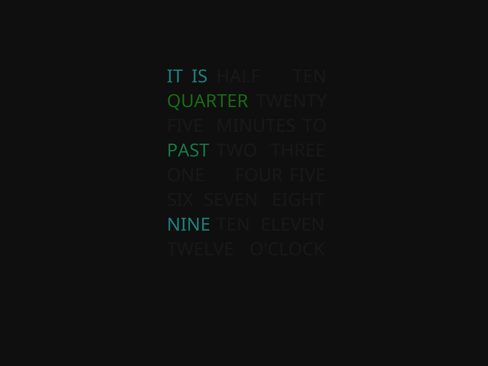

# HaikuTextClock
### by BachToTheFuture, copyright 2018
**A Haiku screen saver that shows a text/word clock.** Tested on x86_64 Haiku Beta.

Design inspiration from https://github.com/brobergp/MMM-TextClock. Thank you, brobergp!

### How to install
Simply run `make` and copy the binary to `/boot/home/config/non-packaged/add-ons/Screen Savers/`.

### How to use
Moving the tick speed slider changes the speed of the color change.

Move the red, green, or blue's max or min sliders around to get desired colors.

To disable a certain color, simply slide the color's max and min sliders to the left.

