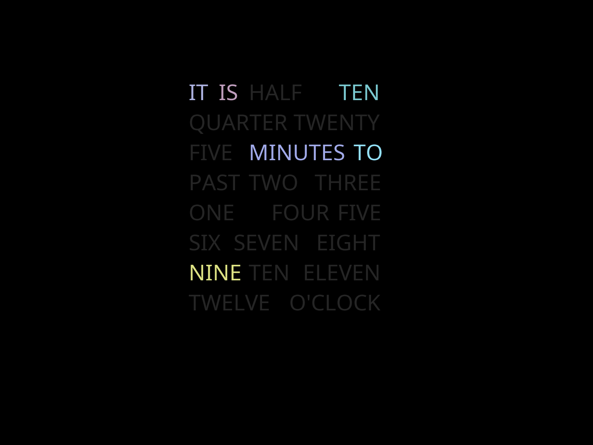

# HaikuTextClock
### by BachToTheFuture, 2018
A Haiku screen saver that shows a text/word clock. Tested on x86_64 Haiku Beta.

Design inspiration from https://github,com/brobergp/MMM-TextClock. Thank you, brobergp!

### How to install
Simply run `make` and copy the binary to `/boot/home/config/non-packaged/add-ons/Screen Savers/`.

